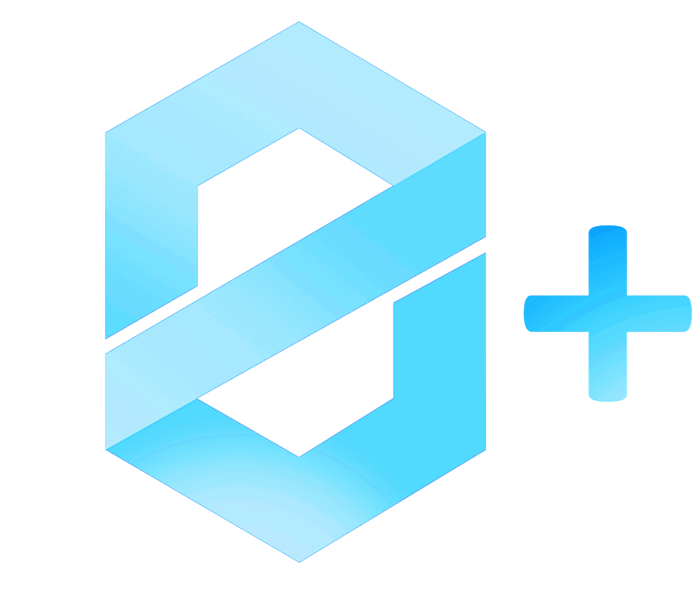

# ZeroNet Plus

This app gives new features to ZeroNet.

Built using [Construct 2 program](https://www.scirra.com/construct2) created by Scirra, and exported to [Electron](https://electronjs.org/).

# Build instructions

When openning ZeroNet Plus.capx on Construct 2, click "File" and then click "Export".
Choose to export to Kongregate, then export to the "Export" folder (where are Electron files).

Use [Electrify](https://github.com/jyapayne/Electrify) or any other Electron builder, and build your app.
